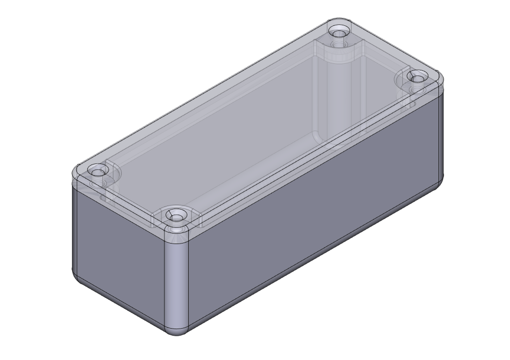

# Generic-Parametric-Printable-Box
Generic-Parametric-Printable-Box made with FreeCAD. Released as FCStd, STEP and STL

## Configurations

| Partnumber   |   inside_length (mm) |   inside_width (mm) |   box_inside_height (mm) |   box_thickness (mm) | Download_Link                                                                                                                 |
|:-------------|---------------------:|--------------------:|-------------------------:|---------------------:|:------------------------------------------------------------------------------------------------------------------------------|
| GPPB-00001   |                   88 |                  34 |                       27 |                  1.5 | [Download](https://github.com/alekssadowski95/Generic-Parametric-Printable-Box/releases/latest/GPPB-00001_88_34_27_regular)   |
| GPPB-00002   |                   25 |                  25 |                       25 |                  1.5 | [Download](https://github.com/alekssadowski95/Generic-Parametric-Printable-Box/releases/latest/GPPB-00002_25_25_25_regular)   |
| GPPB-00003   |                   30 |                  25 |                       25 |                  1.5 | [Download](https://github.com/alekssadowski95/Generic-Parametric-Printable-Box/releases/latest/GPPB-00003_30_25_25_regular)   |
| GPPB-00004   |                   30 |                  30 |                       25 |                  1.5 | [Download](https://github.com/alekssadowski95/Generic-Parametric-Printable-Box/releases/latest/GPPB-00004_30_30_25_regular)   |
| GPPB-00005   |                   35 |                  30 |                       25 |                  1.5 | [Download](https://github.com/alekssadowski95/Generic-Parametric-Printable-Box/releases/latest/GPPB-00005_35_30_25_regular)   |
| GPPB-00006   |                   35 |                  35 |                       25 |                  1.5 | [Download](https://github.com/alekssadowski95/Generic-Parametric-Printable-Box/releases/latest/GPPB-00006_35_35_25_regular)   |
| GPPB-00007   |                   40 |                  35 |                       25 |                  1.5 | [Download](https://github.com/alekssadowski95/Generic-Parametric-Printable-Box/releases/latest/GPPB-00007_40_35_25_regular)   |
| GPPB-00008   |                   40 |                  40 |                       25 |                  1.5 | [Download](https://github.com/alekssadowski95/Generic-Parametric-Printable-Box/releases/latest/GPPB-00008_40_40_25_regular)   |
| GPPB-00009   |                   45 |                  40 |                       25 |                  1.5 | [Download](https://github.com/alekssadowski95/Generic-Parametric-Printable-Box/releases/latest/GPPB-00009_45_40_25_regular)   |
| GPPB-00010   |                   45 |                  45 |                       25 |                  1.5 | [Download](https://github.com/alekssadowski95/Generic-Parametric-Printable-Box/releases/latest/GPPB-00010_45_45_25_regular)   |
| GPPB-00011   |                   50 |                  45 |                       25 |                  1.5 | [Download](https://github.com/alekssadowski95/Generic-Parametric-Printable-Box/releases/latest/GPPB-00011_50_45_25_regular)   |
| GPPB-00012   |                   50 |                  50 |                       25 |                  1.5 | [Download](https://github.com/alekssadowski95/Generic-Parametric-Printable-Box/releases/latest/GPPB-00012_50_50_25_regular)   |
| GPPB-00013   |                   55 |                  50 |                       25 |                  1.5 | [Download](https://github.com/alekssadowski95/Generic-Parametric-Printable-Box/releases/latest/GPPB-00013_55_50_25_regular)   |
| GPPB-00014   |                   55 |                  55 |                       25 |                  1.5 | [Download](https://github.com/alekssadowski95/Generic-Parametric-Printable-Box/releases/latest/GPPB-00014_55_55_25_regular)   |
| GPPB-00015   |                   60 |                  55 |                       25 |                  1.5 | [Download](https://github.com/alekssadowski95/Generic-Parametric-Printable-Box/releases/latest/GPPB-00015_60_55_25_regular)   |
| GPPB-00016   |                   60 |                  60 |                       25 |                  1.5 | [Download](https://github.com/alekssadowski95/Generic-Parametric-Printable-Box/releases/latest/GPPB-00016_60_60_25_regular)   |
| GPPB-00017   |                   65 |                  60 |                       25 |                  1.5 | [Download](https://github.com/alekssadowski95/Generic-Parametric-Printable-Box/releases/latest/GPPB-00017_65_60_25_regular)   |
| GPPB-00018   |                   65 |                  65 |                       25 |                  1.5 | [Download](https://github.com/alekssadowski95/Generic-Parametric-Printable-Box/releases/latest/GPPB-00018_65_65_25_regular)   |
| GPPB-00019   |                   70 |                  65 |                       25 |                  1.5 | [Download](https://github.com/alekssadowski95/Generic-Parametric-Printable-Box/releases/latest/GPPB-00019_70_65_25_regular)   |
| GPPB-00020   |                   70 |                  70 |                       25 |                  1.5 | [Download](https://github.com/alekssadowski95/Generic-Parametric-Printable-Box/releases/latest/GPPB-00020_70_70_25_regular)   |
| GPPB-00021   |                   75 |                  70 |                       25 |                  1.5 | [Download](https://github.com/alekssadowski95/Generic-Parametric-Printable-Box/releases/latest/GPPB-00021_75_70_25_regular)   |
| GPPB-00022   |                   75 |                  75 |                       25 |                  1.5 | [Download](https://github.com/alekssadowski95/Generic-Parametric-Printable-Box/releases/latest/GPPB-00022_75_75_25_regular)   |
| GPPB-00023   |                   80 |                  75 |                       25 |                  1.5 | [Download](https://github.com/alekssadowski95/Generic-Parametric-Printable-Box/releases/latest/GPPB-00023_80_75_25_regular)   |
| GPPB-00024   |                   80 |                  80 |                       25 |                  1.5 | [Download](https://github.com/alekssadowski95/Generic-Parametric-Printable-Box/releases/latest/GPPB-00024_80_80_25_regular)   |
| GPPB-00025   |                   85 |                  80 |                       25 |                  1.5 | [Download](https://github.com/alekssadowski95/Generic-Parametric-Printable-Box/releases/latest/GPPB-00025_85_80_25_regular)   |
| GPPB-00026   |                   85 |                  85 |                       25 |                  1.5 | [Download](https://github.com/alekssadowski95/Generic-Parametric-Printable-Box/releases/latest/GPPB-00026_85_85_25_regular)   |
| GPPB-00027   |                   90 |                  85 |                       25 |                  1.5 | [Download](https://github.com/alekssadowski95/Generic-Parametric-Printable-Box/releases/latest/GPPB-00027_90_85_25_regular)   |
| GPPB-00028   |                   90 |                  90 |                       25 |                  1.5 | [Download](https://github.com/alekssadowski95/Generic-Parametric-Printable-Box/releases/latest/GPPB-00028_90_90_25_regular)   |
| GPPB-00029   |                   95 |                  90 |                       25 |                  1.5 | [Download](https://github.com/alekssadowski95/Generic-Parametric-Printable-Box/releases/latest/GPPB-00029_95_90_25_regular)   |
| GPPB-00030   |                   95 |                  95 |                       25 |                  1.5 | [Download](https://github.com/alekssadowski95/Generic-Parametric-Printable-Box/releases/latest/GPPB-00030_95_95_25_regular)   |
| GPPB-00031   |                  100 |                  95 |                       25 |                  1.5 | [Download](https://github.com/alekssadowski95/Generic-Parametric-Printable-Box/releases/latest/GPPB-00031_100_95_25_regular)  |
| GPPB-00032   |                  100 |                 100 |                       25 |                  1.5 | [Download](https://github.com/alekssadowski95/Generic-Parametric-Printable-Box/releases/latest/GPPB-00032_100_100_25_regular) |
| GPPB-00033   |                  105 |                 100 |                       25 |                  1.5 | [Download](https://github.com/alekssadowski95/Generic-Parametric-Printable-Box/releases/latest/GPPB-00033_105_100_25_regular) |
| GPPB-00034   |                  105 |                 105 |                       25 |                  1.5 | [Download](https://github.com/alekssadowski95/Generic-Parametric-Printable-Box/releases/latest/GPPB-00034_105_105_25_regular) |
| GPPB-00035   |                  110 |                 105 |                       25 |                  1.5 | [Download](https://github.com/alekssadowski95/Generic-Parametric-Printable-Box/releases/latest/GPPB-00035_110_105_25_regular) |
| GPPB-00036   |                  115 |                 110 |                       25 |                  1.5 | [Download](https://github.com/alekssadowski95/Generic-Parametric-Printable-Box/releases/latest/GPPB-00036_115_110_25_regular) |
| GPPB-00037   |                  115 |                 115 |                       25 |                  1.5 | [Download](https://github.com/alekssadowski95/Generic-Parametric-Printable-Box/releases/latest/GPPB-00037_115_115_25_regular) |
| GPPB-00038   |                  120 |                 115 |                       25 |                  1.5 | [Download](https://github.com/alekssadowski95/Generic-Parametric-Printable-Box/releases/latest/GPPB-00038_120_115_25_regular) |
| GPPB-00039   |                  120 |                 120 |                       25 |                  1.5 | [Download](https://github.com/alekssadowski95/Generic-Parametric-Printable-Box/releases/latest/GPPB-00039_120_120_25_regular) |
| GPPB-00040   |                  125 |                 120 |                       25 |                  1.5 | [Download](https://github.com/alekssadowski95/Generic-Parametric-Printable-Box/releases/latest/GPPB-00040_125_120_25_regular) |
| GPPB-00041   |                  125 |                 125 |                       25 |                  1.5 | [Download](https://github.com/alekssadowski95/Generic-Parametric-Printable-Box/releases/latest/GPPB-00041_125_125_25_regular) |
| GPPB-00042   |                  130 |                 125 |                       25 |                  1.5 | [Download](https://github.com/alekssadowski95/Generic-Parametric-Printable-Box/releases/latest/GPPB-00042_130_125_25_regular) |
| GPPB-00043   |                  130 |                 130 |                       25 |                  1.5 | [Download](https://github.com/alekssadowski95/Generic-Parametric-Printable-Box/releases/latest/GPPB-00043_130_130_25_regular) |
| GPPB-00044   |                  135 |                 130 |                       25 |                  1.5 | [Download](https://github.com/alekssadowski95/Generic-Parametric-Printable-Box/releases/latest/GPPB-00044_135_130_25_regular) |
| GPPB-00045   |                  135 |                 135 |                       25 |                  1.5 | [Download](https://github.com/alekssadowski95/Generic-Parametric-Printable-Box/releases/latest/GPPB-00045_135_135_25_regular) |
| GPPB-00046   |                  140 |                 135 |                       25 |                  1.5 | [Download](https://github.com/alekssadowski95/Generic-Parametric-Printable-Box/releases/latest/GPPB-00046_140_135_25_regular) |
| GPPB-00047   |                  140 |                 140 |                       25 |                  1.5 | [Download](https://github.com/alekssadowski95/Generic-Parametric-Printable-Box/releases/latest/GPPB-00047_140_140_25_regular) |
| GPPB-00048   |                  145 |                 140 |                       25 |                  1.5 | [Download](https://github.com/alekssadowski95/Generic-Parametric-Printable-Box/releases/latest/GPPB-00048_145_140_25_regular) |
| GPPB-00049   |                  145 |                 145 |                       25 |                  1.5 | [Download](https://github.com/alekssadowski95/Generic-Parametric-Printable-Box/releases/latest/GPPB-00049_145_145_25_regular) |
| GPPB-00050   |                  150 |                 145 |                       25 |                  1.5 | [Download](https://github.com/alekssadowski95/Generic-Parametric-Printable-Box/releases/latest/GPPB-00050_150_145_25_regular) |
| GPPB-00051   |                  150 |                 150 |                       25 |                  1.5 | [Download](https://github.com/alekssadowski95/Generic-Parametric-Printable-Box/releases/latest/GPPB-00051_150_150_25_regular) |
| GPPB-00052   |                   25 |                  25 |                       35 |                  1.5 | [Download](https://github.com/alekssadowski95/Generic-Parametric-Printable-Box/releases/latest/GPPB-00052_25_25_35_regular)   |
| GPPB-00053   |                   30 |                  25 |                       35 |                  1.5 | [Download](https://github.com/alekssadowski95/Generic-Parametric-Printable-Box/releases/latest/GPPB-00053_30_25_35_regular)   |
| GPPB-00054   |                   30 |                  30 |                       35 |                  1.5 | [Download](https://github.com/alekssadowski95/Generic-Parametric-Printable-Box/releases/latest/GPPB-00054_30_30_35_regular)   |
| GPPB-00055   |                   35 |                  30 |                       35 |                  1.5 | [Download](https://github.com/alekssadowski95/Generic-Parametric-Printable-Box/releases/latest/GPPB-00055_35_30_35_regular)   |
| GPPB-00056   |                   35 |                  35 |                       35 |                  1.5 | [Download](https://github.com/alekssadowski95/Generic-Parametric-Printable-Box/releases/latest/GPPB-00056_35_35_35_regular)   |
| GPPB-00057   |                   40 |                  35 |                       35 |                  1.5 | [Download](https://github.com/alekssadowski95/Generic-Parametric-Printable-Box/releases/latest/GPPB-00057_40_35_35_regular)   |
| GPPB-00058   |                   40 |                  40 |                       35 |                  1.5 | [Download](https://github.com/alekssadowski95/Generic-Parametric-Printable-Box/releases/latest/GPPB-00058_40_40_35_regular)   |
| GPPB-00059   |                   45 |                  40 |                       35 |                  1.5 | [Download](https://github.com/alekssadowski95/Generic-Parametric-Printable-Box/releases/latest/GPPB-00059_45_40_35_regular)   |
| GPPB-00060   |                   45 |                  45 |                       35 |                  1.5 | [Download](https://github.com/alekssadowski95/Generic-Parametric-Printable-Box/releases/latest/GPPB-00060_45_45_35_regular)   |
| GPPB-00061   |                   50 |                  45 |                       35 |                  1.5 | [Download](https://github.com/alekssadowski95/Generic-Parametric-Printable-Box/releases/latest/GPPB-00061_50_45_35_regular)   |
| GPPB-00062   |                   50 |                  50 |                       35 |                  1.5 | [Download](https://github.com/alekssadowski95/Generic-Parametric-Printable-Box/releases/latest/GPPB-00062_50_50_35_regular)   |
| GPPB-00063   |                   55 |                  50 |                       35 |                  1.5 | [Download](https://github.com/alekssadowski95/Generic-Parametric-Printable-Box/releases/latest/GPPB-00063_55_50_35_regular)   |
| GPPB-00064   |                   55 |                  55 |                       35 |                  1.5 | [Download](https://github.com/alekssadowski95/Generic-Parametric-Printable-Box/releases/latest/GPPB-00064_55_55_35_regular)   |
| GPPB-00065   |                   60 |                  55 |                       35 |                  1.5 | [Download](https://github.com/alekssadowski95/Generic-Parametric-Printable-Box/releases/latest/GPPB-00065_60_55_35_regular)   |
| GPPB-00066   |                   60 |                  60 |                       35 |                  1.5 | [Download](https://github.com/alekssadowski95/Generic-Parametric-Printable-Box/releases/latest/GPPB-00066_60_60_35_regular)   |
| GPPB-00067   |                   65 |                  60 |                       35 |                  1.5 | [Download](https://github.com/alekssadowski95/Generic-Parametric-Printable-Box/releases/latest/GPPB-00067_65_60_35_regular)   |
| GPPB-00068   |                   65 |                  65 |                       35 |                  1.5 | [Download](https://github.com/alekssadowski95/Generic-Parametric-Printable-Box/releases/latest/GPPB-00068_65_65_35_regular)   |
| GPPB-00069   |                   70 |                  65 |                       35 |                  1.5 | [Download](https://github.com/alekssadowski95/Generic-Parametric-Printable-Box/releases/latest/GPPB-00069_70_65_35_regular)   |
| GPPB-00070   |                   70 |                  70 |                       35 |                  1.5 | [Download](https://github.com/alekssadowski95/Generic-Parametric-Printable-Box/releases/latest/GPPB-00070_70_70_35_regular)   |
| GPPB-00071   |                   75 |                  70 |                       35 |                  1.5 | [Download](https://github.com/alekssadowski95/Generic-Parametric-Printable-Box/releases/latest/GPPB-00071_75_70_35_regular)   |
| GPPB-00072   |                   75 |                  75 |                       35 |                  1.5 | [Download](https://github.com/alekssadowski95/Generic-Parametric-Printable-Box/releases/latest/GPPB-00072_75_75_35_regular)   |
| GPPB-00073   |                   80 |                  75 |                       35 |                  1.5 | [Download](https://github.com/alekssadowski95/Generic-Parametric-Printable-Box/releases/latest/GPPB-00073_80_75_35_regular)   |
| GPPB-00074   |                   80 |                  80 |                       35 |                  1.5 | [Download](https://github.com/alekssadowski95/Generic-Parametric-Printable-Box/releases/latest/GPPB-00074_80_80_35_regular)   |
| GPPB-00075   |                   85 |                  80 |                       35 |                  1.5 | [Download](https://github.com/alekssadowski95/Generic-Parametric-Printable-Box/releases/latest/GPPB-00075_85_80_35_regular)   |
| GPPB-00076   |                   85 |                  85 |                       35 |                  1.5 | [Download](https://github.com/alekssadowski95/Generic-Parametric-Printable-Box/releases/latest/GPPB-00076_85_85_35_regular)   |
| GPPB-00077   |                   90 |                  85 |                       35 |                  1.5 | [Download](https://github.com/alekssadowski95/Generic-Parametric-Printable-Box/releases/latest/GPPB-00077_90_85_35_regular)   |
| GPPB-00078   |                   90 |                  90 |                       35 |                  1.5 | [Download](https://github.com/alekssadowski95/Generic-Parametric-Printable-Box/releases/latest/GPPB-00078_90_90_35_regular)   |
| GPPB-00079   |                   95 |                  90 |                       35 |                  1.5 | [Download](https://github.com/alekssadowski95/Generic-Parametric-Printable-Box/releases/latest/GPPB-00079_95_90_35_regular)   |
| GPPB-00080   |                   95 |                  95 |                       35 |                  1.5 | [Download](https://github.com/alekssadowski95/Generic-Parametric-Printable-Box/releases/latest/GPPB-00080_95_95_35_regular)   |
| GPPB-00081   |                  100 |                  95 |                       35 |                  1.5 | [Download](https://github.com/alekssadowski95/Generic-Parametric-Printable-Box/releases/latest/GPPB-00081_100_95_35_regular)  |
| GPPB-00082   |                  100 |                 100 |                       35 |                  1.5 | [Download](https://github.com/alekssadowski95/Generic-Parametric-Printable-Box/releases/latest/GPPB-00082_100_100_35_regular) |
| GPPB-00083   |                  105 |                 100 |                       35 |                  1.5 | [Download](https://github.com/alekssadowski95/Generic-Parametric-Printable-Box/releases/latest/GPPB-00083_105_100_35_regular) |
| GPPB-00084   |                  105 |                 105 |                       35 |                  1.5 | [Download](https://github.com/alekssadowski95/Generic-Parametric-Printable-Box/releases/latest/GPPB-00084_105_105_35_regular) |
| GPPB-00085   |                  110 |                 105 |                       35 |                  1.5 | [Download](https://github.com/alekssadowski95/Generic-Parametric-Printable-Box/releases/latest/GPPB-00085_110_105_35_regular) |
| GPPB-00086   |                  115 |                 110 |                       35 |                  1.5 | [Download](https://github.com/alekssadowski95/Generic-Parametric-Printable-Box/releases/latest/GPPB-00086_115_110_35_regular) |
| GPPB-00087   |                  115 |                 115 |                       35 |                  1.5 | [Download](https://github.com/alekssadowski95/Generic-Parametric-Printable-Box/releases/latest/GPPB-00087_115_115_35_regular) |
| GPPB-00088   |                  120 |                 115 |                       35 |                  1.5 | [Download](https://github.com/alekssadowski95/Generic-Parametric-Printable-Box/releases/latest/GPPB-00088_120_115_35_regular) |
| GPPB-00089   |                  120 |                 120 |                       35 |                  1.5 | [Download](https://github.com/alekssadowski95/Generic-Parametric-Printable-Box/releases/latest/GPPB-00089_120_120_35_regular) |
| GPPB-00090   |                  125 |                 120 |                       35 |                  1.5 | [Download](https://github.com/alekssadowski95/Generic-Parametric-Printable-Box/releases/latest/GPPB-00090_125_120_35_regular) |
| GPPB-00091   |                  125 |                 125 |                       35 |                  1.5 | [Download](https://github.com/alekssadowski95/Generic-Parametric-Printable-Box/releases/latest/GPPB-00091_125_125_35_regular) |
| GPPB-00092   |                  130 |                 125 |                       35 |                  1.5 | [Download](https://github.com/alekssadowski95/Generic-Parametric-Printable-Box/releases/latest/GPPB-00092_130_125_35_regular) |
| GPPB-00093   |                  130 |                 130 |                       35 |                  1.5 | [Download](https://github.com/alekssadowski95/Generic-Parametric-Printable-Box/releases/latest/GPPB-00093_130_130_35_regular) |
| GPPB-00094   |                  135 |                 130 |                       35 |                  1.5 | [Download](https://github.com/alekssadowski95/Generic-Parametric-Printable-Box/releases/latest/GPPB-00094_135_130_35_regular) |
| GPPB-00095   |                  135 |                 135 |                       35 |                  1.5 | [Download](https://github.com/alekssadowski95/Generic-Parametric-Printable-Box/releases/latest/GPPB-00095_135_135_35_regular) |
| GPPB-00096   |                  140 |                 135 |                       35 |                  1.5 | [Download](https://github.com/alekssadowski95/Generic-Parametric-Printable-Box/releases/latest/GPPB-00096_140_135_35_regular) |
| GPPB-00097   |                  140 |                 140 |                       35 |                  1.5 | [Download](https://github.com/alekssadowski95/Generic-Parametric-Printable-Box/releases/latest/GPPB-00097_140_140_35_regular) |
| GPPB-00098   |                  145 |                 140 |                       35 |                  1.5 | [Download](https://github.com/alekssadowski95/Generic-Parametric-Printable-Box/releases/latest/GPPB-00098_145_140_35_regular) |
| GPPB-00099   |                  145 |                 145 |                       35 |                  1.5 | [Download](https://github.com/alekssadowski95/Generic-Parametric-Printable-Box/releases/latest/GPPB-00099_145_145_35_regular) |
| GPPB-00100   |                  150 |                 145 |                       35 |                  1.5 | [Download](https://github.com/alekssadowski95/Generic-Parametric-Printable-Box/releases/latest/GPPB-00100_150_145_35_regular) |
| GPPB-00101   |                  150 |                 150 |                       35 |                  1.5 | [Download](https://github.com/alekssadowski95/Generic-Parametric-Printable-Box/releases/latest/GPPB-00101_150_150_35_regular) |
| GPPB-00102   |                   25 |                  25 |                       45 |                  1.5 | [Download](https://github.com/alekssadowski95/Generic-Parametric-Printable-Box/releases/latest/GPPB-00102_25_25_45_regular)   |
| GPPB-00103   |                   30 |                  25 |                       45 |                  1.5 | [Download](https://github.com/alekssadowski95/Generic-Parametric-Printable-Box/releases/latest/GPPB-00103_30_25_45_regular)   |
| GPPB-00104   |                   30 |                  30 |                       45 |                  1.5 | [Download](https://github.com/alekssadowski95/Generic-Parametric-Printable-Box/releases/latest/GPPB-00104_30_30_45_regular)   |
| GPPB-00105   |                   35 |                  30 |                       45 |                  1.5 | [Download](https://github.com/alekssadowski95/Generic-Parametric-Printable-Box/releases/latest/GPPB-00105_35_30_45_regular)   |
| GPPB-00106   |                   35 |                  35 |                       45 |                  1.5 | [Download](https://github.com/alekssadowski95/Generic-Parametric-Printable-Box/releases/latest/GPPB-00106_35_35_45_regular)   |
| GPPB-00107   |                   40 |                  35 |                       45 |                  1.5 | [Download](https://github.com/alekssadowski95/Generic-Parametric-Printable-Box/releases/latest/GPPB-00107_40_35_45_regular)   |
| GPPB-00108   |                   40 |                  40 |                       45 |                  1.5 | [Download](https://github.com/alekssadowski95/Generic-Parametric-Printable-Box/releases/latest/GPPB-00108_40_40_45_regular)   |
| GPPB-00109   |                   45 |                  40 |                       45 |                  1.5 | [Download](https://github.com/alekssadowski95/Generic-Parametric-Printable-Box/releases/latest/GPPB-00109_45_40_45_regular)   |
| GPPB-00110   |                   45 |                  45 |                       45 |                  1.5 | [Download](https://github.com/alekssadowski95/Generic-Parametric-Printable-Box/releases/latest/GPPB-00110_45_45_45_regular)   |
| GPPB-00111   |                   50 |                  45 |                       45 |                  1.5 | [Download](https://github.com/alekssadowski95/Generic-Parametric-Printable-Box/releases/latest/GPPB-00111_50_45_45_regular)   |
| GPPB-00112   |                   50 |                  50 |                       45 |                  1.5 | [Download](https://github.com/alekssadowski95/Generic-Parametric-Printable-Box/releases/latest/GPPB-00112_50_50_45_regular)   |
| GPPB-00113   |                   55 |                  50 |                       45 |                  1.5 | [Download](https://github.com/alekssadowski95/Generic-Parametric-Printable-Box/releases/latest/GPPB-00113_55_50_45_regular)   |
| GPPB-00114   |                   55 |                  55 |                       45 |                  1.5 | [Download](https://github.com/alekssadowski95/Generic-Parametric-Printable-Box/releases/latest/GPPB-00114_55_55_45_regular)   |
| GPPB-00115   |                   60 |                  55 |                       45 |                  1.5 | [Download](https://github.com/alekssadowski95/Generic-Parametric-Printable-Box/releases/latest/GPPB-00115_60_55_45_regular)   |
| GPPB-00116   |                   60 |                  60 |                       45 |                  1.5 | [Download](https://github.com/alekssadowski95/Generic-Parametric-Printable-Box/releases/latest/GPPB-00116_60_60_45_regular)   |
| GPPB-00117   |                   65 |                  60 |                       45 |                  1.5 | [Download](https://github.com/alekssadowski95/Generic-Parametric-Printable-Box/releases/latest/GPPB-00117_65_60_45_regular)   |
| GPPB-00118   |                   65 |                  65 |                       45 |                  1.5 | [Download](https://github.com/alekssadowski95/Generic-Parametric-Printable-Box/releases/latest/GPPB-00118_65_65_45_regular)   |
| GPPB-00119   |                   70 |                  65 |                       45 |                  1.5 | [Download](https://github.com/alekssadowski95/Generic-Parametric-Printable-Box/releases/latest/GPPB-00119_70_65_45_regular)   |
| GPPB-00120   |                   70 |                  70 |                       45 |                  1.5 | [Download](https://github.com/alekssadowski95/Generic-Parametric-Printable-Box/releases/latest/GPPB-00120_70_70_45_regular)   |
| GPPB-00121   |                   75 |                  70 |                       45 |                  1.5 | [Download](https://github.com/alekssadowski95/Generic-Parametric-Printable-Box/releases/latest/GPPB-00121_75_70_45_regular)   |
| GPPB-00122   |                   75 |                  75 |                       45 |                  1.5 | [Download](https://github.com/alekssadowski95/Generic-Parametric-Printable-Box/releases/latest/GPPB-00122_75_75_45_regular)   |
| GPPB-00123   |                   80 |                  75 |                       45 |                  1.5 | [Download](https://github.com/alekssadowski95/Generic-Parametric-Printable-Box/releases/latest/GPPB-00123_80_75_45_regular)   |
| GPPB-00124   |                   80 |                  80 |                       45 |                  1.5 | [Download](https://github.com/alekssadowski95/Generic-Parametric-Printable-Box/releases/latest/GPPB-00124_80_80_45_regular)   |
| GPPB-00125   |                   85 |                  80 |                       45 |                  1.5 | [Download](https://github.com/alekssadowski95/Generic-Parametric-Printable-Box/releases/latest/GPPB-00125_85_80_45_regular)   |
| GPPB-00126   |                   85 |                  85 |                       45 |                  1.5 | [Download](https://github.com/alekssadowski95/Generic-Parametric-Printable-Box/releases/latest/GPPB-00126_85_85_45_regular)   |
| GPPB-00127   |                   90 |                  85 |                       45 |                  1.5 | [Download](https://github.com/alekssadowski95/Generic-Parametric-Printable-Box/releases/latest/GPPB-00127_90_85_45_regular)   |
| GPPB-00128   |                   90 |                  90 |                       45 |                  1.5 | [Download](https://github.com/alekssadowski95/Generic-Parametric-Printable-Box/releases/latest/GPPB-00128_90_90_45_regular)   |
| GPPB-00129   |                   95 |                  90 |                       45 |                  1.5 | [Download](https://github.com/alekssadowski95/Generic-Parametric-Printable-Box/releases/latest/GPPB-00129_95_90_45_regular)   |
| GPPB-00130   |                   95 |                  95 |                       45 |                  1.5 | [Download](https://github.com/alekssadowski95/Generic-Parametric-Printable-Box/releases/latest/GPPB-00130_95_95_45_regular)   |
| GPPB-00131   |                  100 |                  95 |                       45 |                  1.5 | [Download](https://github.com/alekssadowski95/Generic-Parametric-Printable-Box/releases/latest/GPPB-00131_100_95_45_regular)  |
| GPPB-00132   |                  100 |                 100 |                       45 |                  1.5 | [Download](https://github.com/alekssadowski95/Generic-Parametric-Printable-Box/releases/latest/GPPB-00132_100_100_45_regular) |
| GPPB-00133   |                  105 |                 100 |                       45 |                  1.5 | [Download](https://github.com/alekssadowski95/Generic-Parametric-Printable-Box/releases/latest/GPPB-00133_105_100_45_regular) |
| GPPB-00134   |                  105 |                 105 |                       45 |                  1.5 | [Download](https://github.com/alekssadowski95/Generic-Parametric-Printable-Box/releases/latest/GPPB-00134_105_105_45_regular) |
| GPPB-00135   |                  110 |                 105 |                       45 |                  1.5 | [Download](https://github.com/alekssadowski95/Generic-Parametric-Printable-Box/releases/latest/GPPB-00135_110_105_45_regular) |
| GPPB-00136   |                  115 |                 110 |                       45 |                  1.5 | [Download](https://github.com/alekssadowski95/Generic-Parametric-Printable-Box/releases/latest/GPPB-00136_115_110_45_regular) |
| GPPB-00137   |                  115 |                 115 |                       45 |                  1.5 | [Download](https://github.com/alekssadowski95/Generic-Parametric-Printable-Box/releases/latest/GPPB-00137_115_115_45_regular) |
| GPPB-00138   |                  120 |                 115 |                       45 |                  1.5 | [Download](https://github.com/alekssadowski95/Generic-Parametric-Printable-Box/releases/latest/GPPB-00138_120_115_45_regular) |
| GPPB-00139   |                  120 |                 120 |                       45 |                  1.5 | [Download](https://github.com/alekssadowski95/Generic-Parametric-Printable-Box/releases/latest/GPPB-00139_120_120_45_regular) |
| GPPB-00140   |                  125 |                 120 |                       45 |                  1.5 | [Download](https://github.com/alekssadowski95/Generic-Parametric-Printable-Box/releases/latest/GPPB-00140_125_120_45_regular) |
| GPPB-00141   |                  125 |                 125 |                       45 |                  1.5 | [Download](https://github.com/alekssadowski95/Generic-Parametric-Printable-Box/releases/latest/GPPB-00141_125_125_45_regular) |
| GPPB-00142   |                  130 |                 125 |                       45 |                  1.5 | [Download](https://github.com/alekssadowski95/Generic-Parametric-Printable-Box/releases/latest/GPPB-00142_130_125_45_regular) |
| GPPB-00143   |                  130 |                 130 |                       45 |                  1.5 | [Download](https://github.com/alekssadowski95/Generic-Parametric-Printable-Box/releases/latest/GPPB-00143_130_130_45_regular) |
| GPPB-00144   |                  135 |                 130 |                       45 |                  1.5 | [Download](https://github.com/alekssadowski95/Generic-Parametric-Printable-Box/releases/latest/GPPB-00144_135_130_45_regular) |
| GPPB-00145   |                  135 |                 135 |                       45 |                  1.5 | [Download](https://github.com/alekssadowski95/Generic-Parametric-Printable-Box/releases/latest/GPPB-00145_135_135_45_regular) |
| GPPB-00146   |                  140 |                 135 |                       45 |                  1.5 | [Download](https://github.com/alekssadowski95/Generic-Parametric-Printable-Box/releases/latest/GPPB-00146_140_135_45_regular) |
| GPPB-00147   |                  140 |                 140 |                       45 |                  1.5 | [Download](https://github.com/alekssadowski95/Generic-Parametric-Printable-Box/releases/latest/GPPB-00147_140_140_45_regular) |
| GPPB-00148   |                  145 |                 140 |                       45 |                  1.5 | [Download](https://github.com/alekssadowski95/Generic-Parametric-Printable-Box/releases/latest/GPPB-00148_145_140_45_regular) |
| GPPB-00149   |                  145 |                 145 |                       45 |                  1.5 | [Download](https://github.com/alekssadowski95/Generic-Parametric-Printable-Box/releases/latest/GPPB-00149_145_145_45_regular) |
| GPPB-00150   |                  150 |                 145 |                       45 |                  1.5 | [Download](https://github.com/alekssadowski95/Generic-Parametric-Printable-Box/releases/latest/GPPB-00150_150_145_45_regular) |
| GPPB-00151   |                  150 |                 150 |                       45 |                  1.5 | [Download](https://github.com/alekssadowski95/Generic-Parametric-Printable-Box/releases/latest/GPPB-00151_150_150_45_regular) |
| GPPB-00152   |                   25 |                  25 |                       55 |                  1.5 | [Download](https://github.com/alekssadowski95/Generic-Parametric-Printable-Box/releases/latest/GPPB-00152_25_25_55_regular)   |
| GPPB-00153   |                   30 |                  25 |                       55 |                  1.5 | [Download](https://github.com/alekssadowski95/Generic-Parametric-Printable-Box/releases/latest/GPPB-00153_30_25_55_regular)   |
| GPPB-00154   |                   30 |                  30 |                       55 |                  1.5 | [Download](https://github.com/alekssadowski95/Generic-Parametric-Printable-Box/releases/latest/GPPB-00154_30_30_55_regular)   |
| GPPB-00155   |                   35 |                  30 |                       55 |                  1.5 | [Download](https://github.com/alekssadowski95/Generic-Parametric-Printable-Box/releases/latest/GPPB-00155_35_30_55_regular)   |
| GPPB-00156   |                   35 |                  35 |                       55 |                  1.5 | [Download](https://github.com/alekssadowski95/Generic-Parametric-Printable-Box/releases/latest/GPPB-00156_35_35_55_regular)   |
| GPPB-00157   |                   40 |                  35 |                       55 |                  1.5 | [Download](https://github.com/alekssadowski95/Generic-Parametric-Printable-Box/releases/latest/GPPB-00157_40_35_55_regular)   |
| GPPB-00158   |                   40 |                  40 |                       55 |                  1.5 | [Download](https://github.com/alekssadowski95/Generic-Parametric-Printable-Box/releases/latest/GPPB-00158_40_40_55_regular)   |
| GPPB-00159   |                   45 |                  40 |                       55 |                  1.5 | [Download](https://github.com/alekssadowski95/Generic-Parametric-Printable-Box/releases/latest/GPPB-00159_45_40_55_regular)   |
| GPPB-00160   |                   45 |                  45 |                       55 |                  1.5 | [Download](https://github.com/alekssadowski95/Generic-Parametric-Printable-Box/releases/latest/GPPB-00160_45_45_55_regular)   |
| GPPB-00161   |                   50 |                  45 |                       55 |                  1.5 | [Download](https://github.com/alekssadowski95/Generic-Parametric-Printable-Box/releases/latest/GPPB-00161_50_45_55_regular)   |
| GPPB-00162   |                   50 |                  50 |                       55 |                  1.5 | [Download](https://github.com/alekssadowski95/Generic-Parametric-Printable-Box/releases/latest/GPPB-00162_50_50_55_regular)   |
| GPPB-00163   |                   55 |                  50 |                       55 |                  1.5 | [Download](https://github.com/alekssadowski95/Generic-Parametric-Printable-Box/releases/latest/GPPB-00163_55_50_55_regular)   |
| GPPB-00164   |                   55 |                  55 |                       55 |                  1.5 | [Download](https://github.com/alekssadowski95/Generic-Parametric-Printable-Box/releases/latest/GPPB-00164_55_55_55_regular)   |
| GPPB-00165   |                   60 |                  55 |                       55 |                  1.5 | [Download](https://github.com/alekssadowski95/Generic-Parametric-Printable-Box/releases/latest/GPPB-00165_60_55_55_regular)   |
| GPPB-00166   |                   60 |                  60 |                       55 |                  1.5 | [Download](https://github.com/alekssadowski95/Generic-Parametric-Printable-Box/releases/latest/GPPB-00166_60_60_55_regular)   |
| GPPB-00167   |                   65 |                  60 |                       55 |                  1.5 | [Download](https://github.com/alekssadowski95/Generic-Parametric-Printable-Box/releases/latest/GPPB-00167_65_60_55_regular)   |
| GPPB-00168   |                   65 |                  65 |                       55 |                  1.5 | [Download](https://github.com/alekssadowski95/Generic-Parametric-Printable-Box/releases/latest/GPPB-00168_65_65_55_regular)   |
| GPPB-00169   |                   70 |                  65 |                       55 |                  1.5 | [Download](https://github.com/alekssadowski95/Generic-Parametric-Printable-Box/releases/latest/GPPB-00169_70_65_55_regular)   |
| GPPB-00170   |                   70 |                  70 |                       55 |                  1.5 | [Download](https://github.com/alekssadowski95/Generic-Parametric-Printable-Box/releases/latest/GPPB-00170_70_70_55_regular)   |
| GPPB-00171   |                   75 |                  70 |                       55 |                  1.5 | [Download](https://github.com/alekssadowski95/Generic-Parametric-Printable-Box/releases/latest/GPPB-00171_75_70_55_regular)   |
| GPPB-00172   |                   75 |                  75 |                       55 |                  1.5 | [Download](https://github.com/alekssadowski95/Generic-Parametric-Printable-Box/releases/latest/GPPB-00172_75_75_55_regular)   |
| GPPB-00173   |                   80 |                  75 |                       55 |                  1.5 | [Download](https://github.com/alekssadowski95/Generic-Parametric-Printable-Box/releases/latest/GPPB-00173_80_75_55_regular)   |
| GPPB-00174   |                   80 |                  80 |                       55 |                  1.5 | [Download](https://github.com/alekssadowski95/Generic-Parametric-Printable-Box/releases/latest/GPPB-00174_80_80_55_regular)   |
| GPPB-00175   |                   85 |                  80 |                       55 |                  1.5 | [Download](https://github.com/alekssadowski95/Generic-Parametric-Printable-Box/releases/latest/GPPB-00175_85_80_55_regular)   |
| GPPB-00176   |                   85 |                  85 |                       55 |                  1.5 | [Download](https://github.com/alekssadowski95/Generic-Parametric-Printable-Box/releases/latest/GPPB-00176_85_85_55_regular)   |
| GPPB-00177   |                   90 |                  85 |                       55 |                  1.5 | [Download](https://github.com/alekssadowski95/Generic-Parametric-Printable-Box/releases/latest/GPPB-00177_90_85_55_regular)   |
| GPPB-00178   |                   90 |                  90 |                       55 |                  1.5 | [Download](https://github.com/alekssadowski95/Generic-Parametric-Printable-Box/releases/latest/GPPB-00178_90_90_55_regular)   |
| GPPB-00179   |                   95 |                  90 |                       55 |                  1.5 | [Download](https://github.com/alekssadowski95/Generic-Parametric-Printable-Box/releases/latest/GPPB-00179_95_90_55_regular)   |
| GPPB-00180   |                   95 |                  95 |                       55 |                  1.5 | [Download](https://github.com/alekssadowski95/Generic-Parametric-Printable-Box/releases/latest/GPPB-00180_95_95_55_regular)   |
| GPPB-00181   |                  100 |                  95 |                       55 |                  1.5 | [Download](https://github.com/alekssadowski95/Generic-Parametric-Printable-Box/releases/latest/GPPB-00181_100_95_55_regular)  |
| GPPB-00182   |                  100 |                 100 |                       55 |                  1.5 | [Download](https://github.com/alekssadowski95/Generic-Parametric-Printable-Box/releases/latest/GPPB-00182_100_100_55_regular) |
| GPPB-00183   |                  105 |                 100 |                       55 |                  1.5 | [Download](https://github.com/alekssadowski95/Generic-Parametric-Printable-Box/releases/latest/GPPB-00183_105_100_55_regular) |
| GPPB-00184   |                  105 |                 105 |                       55 |                  1.5 | [Download](https://github.com/alekssadowski95/Generic-Parametric-Printable-Box/releases/latest/GPPB-00184_105_105_55_regular) |
| GPPB-00185   |                  110 |                 105 |                       55 |                  1.5 | [Download](https://github.com/alekssadowski95/Generic-Parametric-Printable-Box/releases/latest/GPPB-00185_110_105_55_regular) |
| GPPB-00186   |                  115 |                 110 |                       55 |                  1.5 | [Download](https://github.com/alekssadowski95/Generic-Parametric-Printable-Box/releases/latest/GPPB-00186_115_110_55_regular) |
| GPPB-00187   |                  115 |                 115 |                       55 |                  1.5 | [Download](https://github.com/alekssadowski95/Generic-Parametric-Printable-Box/releases/latest/GPPB-00187_115_115_55_regular) |
| GPPB-00188   |                  120 |                 115 |                       55 |                  1.5 | [Download](https://github.com/alekssadowski95/Generic-Parametric-Printable-Box/releases/latest/GPPB-00188_120_115_55_regular) |
| GPPB-00189   |                  120 |                 120 |                       55 |                  1.5 | [Download](https://github.com/alekssadowski95/Generic-Parametric-Printable-Box/releases/latest/GPPB-00189_120_120_55_regular) |
| GPPB-00190   |                  125 |                 120 |                       55 |                  1.5 | [Download](https://github.com/alekssadowski95/Generic-Parametric-Printable-Box/releases/latest/GPPB-00190_125_120_55_regular) |
| GPPB-00191   |                  125 |                 125 |                       55 |                  1.5 | [Download](https://github.com/alekssadowski95/Generic-Parametric-Printable-Box/releases/latest/GPPB-00191_125_125_55_regular) |
| GPPB-00192   |                  130 |                 125 |                       55 |                  1.5 | [Download](https://github.com/alekssadowski95/Generic-Parametric-Printable-Box/releases/latest/GPPB-00192_130_125_55_regular) |
| GPPB-00193   |                  130 |                 130 |                       55 |                  1.5 | [Download](https://github.com/alekssadowski95/Generic-Parametric-Printable-Box/releases/latest/GPPB-00193_130_130_55_regular) |
| GPPB-00194   |                  135 |                 130 |                       55 |                  1.5 | [Download](https://github.com/alekssadowski95/Generic-Parametric-Printable-Box/releases/latest/GPPB-00194_135_130_55_regular) |
| GPPB-00195   |                  135 |                 135 |                       55 |                  1.5 | [Download](https://github.com/alekssadowski95/Generic-Parametric-Printable-Box/releases/latest/GPPB-00195_135_135_55_regular) |
| GPPB-00196   |                  140 |                 135 |                       55 |                  1.5 | [Download](https://github.com/alekssadowski95/Generic-Parametric-Printable-Box/releases/latest/GPPB-00196_140_135_55_regular) |
| GPPB-00197   |                  140 |                 140 |                       55 |                  1.5 | [Download](https://github.com/alekssadowski95/Generic-Parametric-Printable-Box/releases/latest/GPPB-00197_140_140_55_regular) |
| GPPB-00198   |                  145 |                 140 |                       55 |                  1.5 | [Download](https://github.com/alekssadowski95/Generic-Parametric-Printable-Box/releases/latest/GPPB-00198_145_140_55_regular) |
| GPPB-00199   |                  145 |                 145 |                       55 |                  1.5 | [Download](https://github.com/alekssadowski95/Generic-Parametric-Printable-Box/releases/latest/GPPB-00199_145_145_55_regular) |
| GPPB-00200   |                  150 |                 145 |                       55 |                  1.5 | [Download](https://github.com/alekssadowski95/Generic-Parametric-Printable-Box/releases/latest/GPPB-00200_150_145_55_regular) |
| GPPB-00201   |                  150 |                 150 |                       55 |                  1.5 | [Download](https://github.com/alekssadowski95/Generic-Parametric-Printable-Box/releases/latest/GPPB-00201_150_150_55_regular) |
| GPPB-00202   |                   25 |                  25 |                       65 |                  1.5 | [Download](https://github.com/alekssadowski95/Generic-Parametric-Printable-Box/releases/latest/GPPB-00202_25_25_65_regular)   |
| GPPB-00203   |                   30 |                  25 |                       65 |                  1.5 | [Download](https://github.com/alekssadowski95/Generic-Parametric-Printable-Box/releases/latest/GPPB-00203_30_25_65_regular)   |
| GPPB-00204   |                   30 |                  30 |                       65 |                  1.5 | [Download](https://github.com/alekssadowski95/Generic-Parametric-Printable-Box/releases/latest/GPPB-00204_30_30_65_regular)   |
| GPPB-00205   |                   35 |                  30 |                       65 |                  1.5 | [Download](https://github.com/alekssadowski95/Generic-Parametric-Printable-Box/releases/latest/GPPB-00205_35_30_65_regular)   |
| GPPB-00206   |                   35 |                  35 |                       65 |                  1.5 | [Download](https://github.com/alekssadowski95/Generic-Parametric-Printable-Box/releases/latest/GPPB-00206_35_35_65_regular)   |
| GPPB-00207   |                   40 |                  35 |                       65 |                  1.5 | [Download](https://github.com/alekssadowski95/Generic-Parametric-Printable-Box/releases/latest/GPPB-00207_40_35_65_regular)   |
| GPPB-00208   |                   40 |                  40 |                       65 |                  1.5 | [Download](https://github.com/alekssadowski95/Generic-Parametric-Printable-Box/releases/latest/GPPB-00208_40_40_65_regular)   |
| GPPB-00209   |                   45 |                  40 |                       65 |                  1.5 | [Download](https://github.com/alekssadowski95/Generic-Parametric-Printable-Box/releases/latest/GPPB-00209_45_40_65_regular)   |
| GPPB-00210   |                   45 |                  45 |                       65 |                  1.5 | [Download](https://github.com/alekssadowski95/Generic-Parametric-Printable-Box/releases/latest/GPPB-00210_45_45_65_regular)   |
| GPPB-00211   |                   50 |                  45 |                       65 |                  1.5 | [Download](https://github.com/alekssadowski95/Generic-Parametric-Printable-Box/releases/latest/GPPB-00211_50_45_65_regular)   |
| GPPB-00212   |                   50 |                  50 |                       65 |                  1.5 | [Download](https://github.com/alekssadowski95/Generic-Parametric-Printable-Box/releases/latest/GPPB-00212_50_50_65_regular)   |
| GPPB-00213   |                   55 |                  50 |                       65 |                  1.5 | [Download](https://github.com/alekssadowski95/Generic-Parametric-Printable-Box/releases/latest/GPPB-00213_55_50_65_regular)   |
| GPPB-00214   |                   55 |                  55 |                       65 |                  1.5 | [Download](https://github.com/alekssadowski95/Generic-Parametric-Printable-Box/releases/latest/GPPB-00214_55_55_65_regular)   |
| GPPB-00215   |                   60 |                  55 |                       65 |                  1.5 | [Download](https://github.com/alekssadowski95/Generic-Parametric-Printable-Box/releases/latest/GPPB-00215_60_55_65_regular)   |
| GPPB-00216   |                   60 |                  60 |                       65 |                  1.5 | [Download](https://github.com/alekssadowski95/Generic-Parametric-Printable-Box/releases/latest/GPPB-00216_60_60_65_regular)   |
| GPPB-00217   |                   65 |                  60 |                       65 |                  1.5 | [Download](https://github.com/alekssadowski95/Generic-Parametric-Printable-Box/releases/latest/GPPB-00217_65_60_65_regular)   |
| GPPB-00218   |                   65 |                  65 |                       65 |                  1.5 | [Download](https://github.com/alekssadowski95/Generic-Parametric-Printable-Box/releases/latest/GPPB-00218_65_65_65_regular)   |
| GPPB-00219   |                   70 |                  65 |                       65 |                  1.5 | [Download](https://github.com/alekssadowski95/Generic-Parametric-Printable-Box/releases/latest/GPPB-00219_70_65_65_regular)   |
| GPPB-00220   |                   70 |                  70 |                       65 |                  1.5 | [Download](https://github.com/alekssadowski95/Generic-Parametric-Printable-Box/releases/latest/GPPB-00220_70_70_65_regular)   |
| GPPB-00221   |                   75 |                  70 |                       65 |                  1.5 | [Download](https://github.com/alekssadowski95/Generic-Parametric-Printable-Box/releases/latest/GPPB-00221_75_70_65_regular)   |
| GPPB-00222   |                   75 |                  75 |                       65 |                  1.5 | [Download](https://github.com/alekssadowski95/Generic-Parametric-Printable-Box/releases/latest/GPPB-00222_75_75_65_regular)   |
| GPPB-00223   |                   80 |                  75 |                       65 |                  1.5 | [Download](https://github.com/alekssadowski95/Generic-Parametric-Printable-Box/releases/latest/GPPB-00223_80_75_65_regular)   |
| GPPB-00224   |                   80 |                  80 |                       65 |                  1.5 | [Download](https://github.com/alekssadowski95/Generic-Parametric-Printable-Box/releases/latest/GPPB-00224_80_80_65_regular)   |
| GPPB-00225   |                   85 |                  80 |                       65 |                  1.5 | [Download](https://github.com/alekssadowski95/Generic-Parametric-Printable-Box/releases/latest/GPPB-00225_85_80_65_regular)   |
| GPPB-00226   |                   85 |                  85 |                       65 |                  1.5 | [Download](https://github.com/alekssadowski95/Generic-Parametric-Printable-Box/releases/latest/GPPB-00226_85_85_65_regular)   |
| GPPB-00227   |                   90 |                  85 |                       65 |                  1.5 | [Download](https://github.com/alekssadowski95/Generic-Parametric-Printable-Box/releases/latest/GPPB-00227_90_85_65_regular)   |
| GPPB-00228   |                   90 |                  90 |                       65 |                  1.5 | [Download](https://github.com/alekssadowski95/Generic-Parametric-Printable-Box/releases/latest/GPPB-00228_90_90_65_regular)   |
| GPPB-00229   |                   95 |                  90 |                       65 |                  1.5 | [Download](https://github.com/alekssadowski95/Generic-Parametric-Printable-Box/releases/latest/GPPB-00229_95_90_65_regular)   |
| GPPB-00230   |                   95 |                  95 |                       65 |                  1.5 | [Download](https://github.com/alekssadowski95/Generic-Parametric-Printable-Box/releases/latest/GPPB-00230_95_95_65_regular)   |
| GPPB-00231   |                  100 |                  95 |                       65 |                  1.5 | [Download](https://github.com/alekssadowski95/Generic-Parametric-Printable-Box/releases/latest/GPPB-00231_100_95_65_regular)  |
| GPPB-00232   |                  100 |                 100 |                       65 |                  1.5 | [Download](https://github.com/alekssadowski95/Generic-Parametric-Printable-Box/releases/latest/GPPB-00232_100_100_65_regular) |
| GPPB-00233   |                  105 |                 100 |                       65 |                  1.5 | [Download](https://github.com/alekssadowski95/Generic-Parametric-Printable-Box/releases/latest/GPPB-00233_105_100_65_regular) |
| GPPB-00234   |                  105 |                 105 |                       65 |                  1.5 | [Download](https://github.com/alekssadowski95/Generic-Parametric-Printable-Box/releases/latest/GPPB-00234_105_105_65_regular) |
| GPPB-00235   |                  110 |                 105 |                       65 |                  1.5 | [Download](https://github.com/alekssadowski95/Generic-Parametric-Printable-Box/releases/latest/GPPB-00235_110_105_65_regular) |
| GPPB-00236   |                  115 |                 110 |                       65 |                  1.5 | [Download](https://github.com/alekssadowski95/Generic-Parametric-Printable-Box/releases/latest/GPPB-00236_115_110_65_regular) |
| GPPB-00237   |                  115 |                 115 |                       65 |                  1.5 | [Download](https://github.com/alekssadowski95/Generic-Parametric-Printable-Box/releases/latest/GPPB-00237_115_115_65_regular) |
| GPPB-00238   |                  120 |                 115 |                       65 |                  1.5 | [Download](https://github.com/alekssadowski95/Generic-Parametric-Printable-Box/releases/latest/GPPB-00238_120_115_65_regular) |
| GPPB-00239   |                  120 |                 120 |                       65 |                  1.5 | [Download](https://github.com/alekssadowski95/Generic-Parametric-Printable-Box/releases/latest/GPPB-00239_120_120_65_regular) |
| GPPB-00240   |                  125 |                 120 |                       65 |                  1.5 | [Download](https://github.com/alekssadowski95/Generic-Parametric-Printable-Box/releases/latest/GPPB-00240_125_120_65_regular) |
| GPPB-00241   |                  125 |                 125 |                       65 |                  1.5 | [Download](https://github.com/alekssadowski95/Generic-Parametric-Printable-Box/releases/latest/GPPB-00241_125_125_65_regular) |
| GPPB-00242   |                  130 |                 125 |                       65 |                  1.5 | [Download](https://github.com/alekssadowski95/Generic-Parametric-Printable-Box/releases/latest/GPPB-00242_130_125_65_regular) |
| GPPB-00243   |                  130 |                 130 |                       65 |                  1.5 | [Download](https://github.com/alekssadowski95/Generic-Parametric-Printable-Box/releases/latest/GPPB-00243_130_130_65_regular) |
| GPPB-00244   |                  135 |                 130 |                       65 |                  1.5 | [Download](https://github.com/alekssadowski95/Generic-Parametric-Printable-Box/releases/latest/GPPB-00244_135_130_65_regular) |
| GPPB-00245   |                  135 |                 135 |                       65 |                  1.5 | [Download](https://github.com/alekssadowski95/Generic-Parametric-Printable-Box/releases/latest/GPPB-00245_135_135_65_regular) |
| GPPB-00246   |                  140 |                 135 |                       65 |                  1.5 | [Download](https://github.com/alekssadowski95/Generic-Parametric-Printable-Box/releases/latest/GPPB-00246_140_135_65_regular) |
| GPPB-00247   |                  140 |                 140 |                       65 |                  1.5 | [Download](https://github.com/alekssadowski95/Generic-Parametric-Printable-Box/releases/latest/GPPB-00247_140_140_65_regular) |
| GPPB-00248   |                  145 |                 140 |                       65 |                  1.5 | [Download](https://github.com/alekssadowski95/Generic-Parametric-Printable-Box/releases/latest/GPPB-00248_145_140_65_regular) |
| GPPB-00249   |                  145 |                 145 |                       65 |                  1.5 | [Download](https://github.com/alekssadowski95/Generic-Parametric-Printable-Box/releases/latest/GPPB-00249_145_145_65_regular) |
| GPPB-00250   |                  150 |                 145 |                       65 |                  1.5 | [Download](https://github.com/alekssadowski95/Generic-Parametric-Printable-Box/releases/latest/GPPB-00250_150_145_65_regular) |
| GPPB-00251   |                  150 |                 150 |                       65 |                  1.5 | [Download](https://github.com/alekssadowski95/Generic-Parametric-Printable-Box/releases/latest/GPPB-00251_150_150_65_regular) |
| GPPB-00252   |                   25 |                  25 |                       75 |                  1.5 | [Download](https://github.com/alekssadowski95/Generic-Parametric-Printable-Box/releases/latest/GPPB-00252_25_25_75_regular)   |
| GPPB-00253   |                   30 |                  25 |                       75 |                  1.5 | [Download](https://github.com/alekssadowski95/Generic-Parametric-Printable-Box/releases/latest/GPPB-00253_30_25_75_regular)   |
| GPPB-00254   |                   30 |                  30 |                       75 |                  1.5 | [Download](https://github.com/alekssadowski95/Generic-Parametric-Printable-Box/releases/latest/GPPB-00254_30_30_75_regular)   |
| GPPB-00255   |                   35 |                  30 |                       75 |                  1.5 | [Download](https://github.com/alekssadowski95/Generic-Parametric-Printable-Box/releases/latest/GPPB-00255_35_30_75_regular)   |
| GPPB-00256   |                   35 |                  35 |                       75 |                  1.5 | [Download](https://github.com/alekssadowski95/Generic-Parametric-Printable-Box/releases/latest/GPPB-00256_35_35_75_regular)   |
| GPPB-00257   |                   40 |                  35 |                       75 |                  1.5 | [Download](https://github.com/alekssadowski95/Generic-Parametric-Printable-Box/releases/latest/GPPB-00257_40_35_75_regular)   |
| GPPB-00258   |                   40 |                  40 |                       75 |                  1.5 | [Download](https://github.com/alekssadowski95/Generic-Parametric-Printable-Box/releases/latest/GPPB-00258_40_40_75_regular)   |
| GPPB-00259   |                   45 |                  40 |                       75 |                  1.5 | [Download](https://github.com/alekssadowski95/Generic-Parametric-Printable-Box/releases/latest/GPPB-00259_45_40_75_regular)   |
| GPPB-00260   |                   45 |                  45 |                       75 |                  1.5 | [Download](https://github.com/alekssadowski95/Generic-Parametric-Printable-Box/releases/latest/GPPB-00260_45_45_75_regular)   |
| GPPB-00261   |                   50 |                  45 |                       75 |                  1.5 | [Download](https://github.com/alekssadowski95/Generic-Parametric-Printable-Box/releases/latest/GPPB-00261_50_45_75_regular)   |
| GPPB-00262   |                   50 |                  50 |                       75 |                  1.5 | [Download](https://github.com/alekssadowski95/Generic-Parametric-Printable-Box/releases/latest/GPPB-00262_50_50_75_regular)   |
| GPPB-00263   |                   55 |                  50 |                       75 |                  1.5 | [Download](https://github.com/alekssadowski95/Generic-Parametric-Printable-Box/releases/latest/GPPB-00263_55_50_75_regular)   |
| GPPB-00264   |                   55 |                  55 |                       75 |                  1.5 | [Download](https://github.com/alekssadowski95/Generic-Parametric-Printable-Box/releases/latest/GPPB-00264_55_55_75_regular)   |
| GPPB-00265   |                   60 |                  55 |                       75 |                  1.5 | [Download](https://github.com/alekssadowski95/Generic-Parametric-Printable-Box/releases/latest/GPPB-00265_60_55_75_regular)   |
| GPPB-00266   |                   60 |                  60 |                       75 |                  1.5 | [Download](https://github.com/alekssadowski95/Generic-Parametric-Printable-Box/releases/latest/GPPB-00266_60_60_75_regular)   |
| GPPB-00267   |                   65 |                  60 |                       75 |                  1.5 | [Download](https://github.com/alekssadowski95/Generic-Parametric-Printable-Box/releases/latest/GPPB-00267_65_60_75_regular)   |
| GPPB-00268   |                   65 |                  65 |                       75 |                  1.5 | [Download](https://github.com/alekssadowski95/Generic-Parametric-Printable-Box/releases/latest/GPPB-00268_65_65_75_regular)   |
| GPPB-00269   |                   70 |                  65 |                       75 |                  1.5 | [Download](https://github.com/alekssadowski95/Generic-Parametric-Printable-Box/releases/latest/GPPB-00269_70_65_75_regular)   |
| GPPB-00270   |                   70 |                  70 |                       75 |                  1.5 | [Download](https://github.com/alekssadowski95/Generic-Parametric-Printable-Box/releases/latest/GPPB-00270_70_70_75_regular)   |
| GPPB-00271   |                   75 |                  70 |                       75 |                  1.5 | [Download](https://github.com/alekssadowski95/Generic-Parametric-Printable-Box/releases/latest/GPPB-00271_75_70_75_regular)   |
| GPPB-00272   |                   75 |                  75 |                       75 |                  1.5 | [Download](https://github.com/alekssadowski95/Generic-Parametric-Printable-Box/releases/latest/GPPB-00272_75_75_75_regular)   |
| GPPB-00273   |                   80 |                  75 |                       75 |                  1.5 | [Download](https://github.com/alekssadowski95/Generic-Parametric-Printable-Box/releases/latest/GPPB-00273_80_75_75_regular)   |
| GPPB-00274   |                   80 |                  80 |                       75 |                  1.5 | [Download](https://github.com/alekssadowski95/Generic-Parametric-Printable-Box/releases/latest/GPPB-00274_80_80_75_regular)   |
| GPPB-00275   |                   85 |                  80 |                       75 |                  1.5 | [Download](https://github.com/alekssadowski95/Generic-Parametric-Printable-Box/releases/latest/GPPB-00275_85_80_75_regular)   |
| GPPB-00276   |                   85 |                  85 |                       75 |                  1.5 | [Download](https://github.com/alekssadowski95/Generic-Parametric-Printable-Box/releases/latest/GPPB-00276_85_85_75_regular)   |
| GPPB-00277   |                   90 |                  85 |                       75 |                  1.5 | [Download](https://github.com/alekssadowski95/Generic-Parametric-Printable-Box/releases/latest/GPPB-00277_90_85_75_regular)   |
| GPPB-00278   |                   90 |                  90 |                       75 |                  1.5 | [Download](https://github.com/alekssadowski95/Generic-Parametric-Printable-Box/releases/latest/GPPB-00278_90_90_75_regular)   |
| GPPB-00279   |                   95 |                  90 |                       75 |                  1.5 | [Download](https://github.com/alekssadowski95/Generic-Parametric-Printable-Box/releases/latest/GPPB-00279_95_90_75_regular)   |
| GPPB-00280   |                   95 |                  95 |                       75 |                  1.5 | [Download](https://github.com/alekssadowski95/Generic-Parametric-Printable-Box/releases/latest/GPPB-00280_95_95_75_regular)   |
| GPPB-00281   |                  100 |                  95 |                       75 |                  1.5 | [Download](https://github.com/alekssadowski95/Generic-Parametric-Printable-Box/releases/latest/GPPB-00281_100_95_75_regular)  |
| GPPB-00282   |                  100 |                 100 |                       75 |                  1.5 | [Download](https://github.com/alekssadowski95/Generic-Parametric-Printable-Box/releases/latest/GPPB-00282_100_100_75_regular) |
| GPPB-00283   |                  105 |                 100 |                       75 |                  1.5 | [Download](https://github.com/alekssadowski95/Generic-Parametric-Printable-Box/releases/latest/GPPB-00283_105_100_75_regular) |
| GPPB-00284   |                  105 |                 105 |                       75 |                  1.5 | [Download](https://github.com/alekssadowski95/Generic-Parametric-Printable-Box/releases/latest/GPPB-00284_105_105_75_regular) |
| GPPB-00285   |                  110 |                 105 |                       75 |                  1.5 | [Download](https://github.com/alekssadowski95/Generic-Parametric-Printable-Box/releases/latest/GPPB-00285_110_105_75_regular) |
| GPPB-00286   |                  115 |                 110 |                       75 |                  1.5 | [Download](https://github.com/alekssadowski95/Generic-Parametric-Printable-Box/releases/latest/GPPB-00286_115_110_75_regular) |
| GPPB-00287   |                  115 |                 115 |                       75 |                  1.5 | [Download](https://github.com/alekssadowski95/Generic-Parametric-Printable-Box/releases/latest/GPPB-00287_115_115_75_regular) |
| GPPB-00288   |                  120 |                 115 |                       75 |                  1.5 | [Download](https://github.com/alekssadowski95/Generic-Parametric-Printable-Box/releases/latest/GPPB-00288_120_115_75_regular) |
| GPPB-00289   |                  120 |                 120 |                       75 |                  1.5 | [Download](https://github.com/alekssadowski95/Generic-Parametric-Printable-Box/releases/latest/GPPB-00289_120_120_75_regular) |
| GPPB-00290   |                  125 |                 120 |                       75 |                  1.5 | [Download](https://github.com/alekssadowski95/Generic-Parametric-Printable-Box/releases/latest/GPPB-00290_125_120_75_regular) |
| GPPB-00291   |                  125 |                 125 |                       75 |                  1.5 | [Download](https://github.com/alekssadowski95/Generic-Parametric-Printable-Box/releases/latest/GPPB-00291_125_125_75_regular) |
| GPPB-00292   |                  130 |                 125 |                       75 |                  1.5 | [Download](https://github.com/alekssadowski95/Generic-Parametric-Printable-Box/releases/latest/GPPB-00292_130_125_75_regular) |
| GPPB-00293   |                  130 |                 130 |                       75 |                  1.5 | [Download](https://github.com/alekssadowski95/Generic-Parametric-Printable-Box/releases/latest/GPPB-00293_130_130_75_regular) |
| GPPB-00294   |                  135 |                 130 |                       75 |                  1.5 | [Download](https://github.com/alekssadowski95/Generic-Parametric-Printable-Box/releases/latest/GPPB-00294_135_130_75_regular) |
| GPPB-00295   |                  135 |                 135 |                       75 |                  1.5 | [Download](https://github.com/alekssadowski95/Generic-Parametric-Printable-Box/releases/latest/GPPB-00295_135_135_75_regular) |
| GPPB-00296   |                  140 |                 135 |                       75 |                  1.5 | [Download](https://github.com/alekssadowski95/Generic-Parametric-Printable-Box/releases/latest/GPPB-00296_140_135_75_regular) |
| GPPB-00297   |                  140 |                 140 |                       75 |                  1.5 | [Download](https://github.com/alekssadowski95/Generic-Parametric-Printable-Box/releases/latest/GPPB-00297_140_140_75_regular) |
| GPPB-00298   |                  145 |                 140 |                       75 |                  1.5 | [Download](https://github.com/alekssadowski95/Generic-Parametric-Printable-Box/releases/latest/GPPB-00298_145_140_75_regular) |
| GPPB-00299   |                  145 |                 145 |                       75 |                  1.5 | [Download](https://github.com/alekssadowski95/Generic-Parametric-Printable-Box/releases/latest/GPPB-00299_145_145_75_regular) |
| GPPB-00300   |                  150 |                 145 |                       75 |                  1.5 | [Download](https://github.com/alekssadowski95/Generic-Parametric-Printable-Box/releases/latest/GPPB-00300_150_145_75_regular) |
| GPPB-00301   |                  150 |                 150 |                       75 |                  1.5 | [Download](https://github.com/alekssadowski95/Generic-Parametric-Printable-Box/releases/latest/GPPB-00301_150_150_75_regular) |